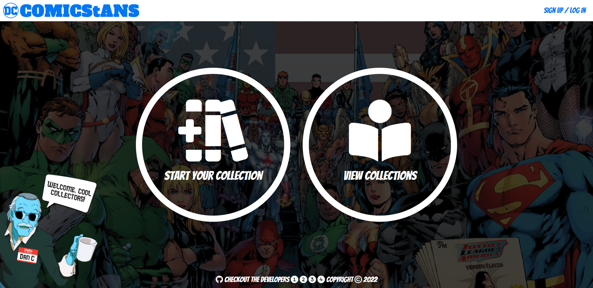

# ComicStans

"Create and compare your comic collection with friends"

<h1>👨‍💻 Mission</h1>

Design a place for DC Comics enthusiasts to keep track of their collection, explore other collections, and discover new titles.

<h1>🌐 Application</h1>

<a href="https://pr1me-e1gh7.github.io/ComicStans/">Link to the App</a>

<h1>💭 Description:</h1>

 Upon loading the homepage, users will be presented with two large buttons, one "New collection" and the other "View collection,"  displayed in the middle of the screen under a navbar that'll allow them to navigate the website. There is also a "Bizzaro-Stan Lee" mascot named Dan C shown on the homepage to help users feel welcome to the site...

<h1>🎨 Preview Image</h1>
